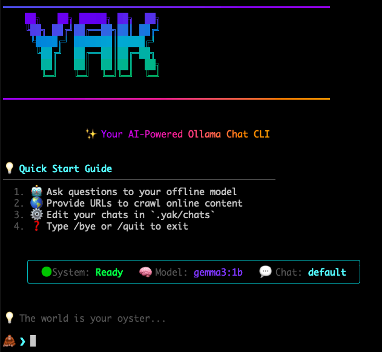

A minimalist local LLM terminal chat interface using [Ollama](https://ollama.com), native streaming, and JSONL memory.

Yak at your local model. Fully offline. Edit or delete your chat history(s).

---

## Features

- 🧠 Runs on any Ollama-compatible model (`gemma3`, `llama3`, `mistral`, etc)
- 🧵 Offline, Real-time streaming replies in the terminal
- 📜 Memory stored in lightweight `jsonl` files on your machine

---

## Requirements

- Node.js 18+
- [Ollama](https://ollama.com) installed and running

---

## Installation
```bash
npm install -g yak-llm
```

## Start

```bash
yak start
```

Start chatting
```
🦧> What's a good name for a chat app?
🤖: How about "Yak"? It's short, and yaks are fluffy like llamas!
```

If you have Ollama downloaded and running, Yak will automatically download a model if none is found.
Yak will also create a new `default` chat session for your first session.

Stop chatting with command or ctrl+c
```
🦧> /bye
```

## Usage

```
🚀 Main Commands
──────────────────────────────────────────────────
  yak start            Start chat session with your model
  yak help             Show this help message
  yak list             List all chat sessions
  yak models           List available models


💬 Chat Management
──────────────────────────────────────────────────
  yak new <name>       Create new chat session
  yak switch <name>    Switch to chat session
  yak delete <name>    Delete chat session
  yak --reset          Clear current chat history


🤖 Model Management
──────────────────────────────────────────────────
  yak model <name>     Switch to different model
  yak models           List downloaded models


💬 In-Chat Commands
──────────────────────────────────────────────────
  /bye or /quit        Exit chat session
  http or www          Chat will detect given URLs and crawl them
```

## Models

You can see your downloaded Ollama models by running:

```bash
yak models
```

You can change the model with the CLI command

```bash
yak model <model-name>
```
or  in the `config.json` file manually.
```json
{
  "model": "gemma3:1b",
}
```

If you want more models, download them from [Ollama](https://ollama.com/search)! 🦙

## History

Don't like your chat? All messages are logged to `.yak/chats`.

You can remove lines from file, or delete the entire log:
```bash
yak delete <name-of-chat-file>
```
